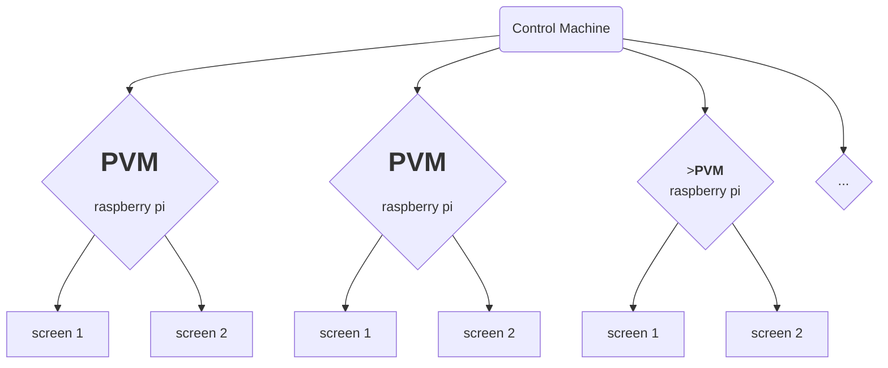

# PVM
Pi Video Machine - a scalable, synchronized, and networked-controlled, raspberry pi based, video player machine for video installations



## Requirements

- [Python3](https://www.python.org/downloads/)
- [Max/MSP](https://cycling74.com/)
- [Raspberry Pi 4](https://www.raspberrypi.com/)
- [OMXPlayer](https://github.com/KaneBetter/omxplayer)


## Installation

1. [Install the required Raspberry Pi OS](#install-the-required-raspberry-pi-os)
2. [Set up the environment for PVM](#set-up-the-environment-for-pvm)
3. [Build and install customized OMXPlayer](#build-and-install-customized-omxplayer)
4. [Install Max 8](https://github.com/omarcostahamido/PVM#install-max-8)


### Install the required Raspberry Pi OS
On the Raspberry Pi device, install the required Operating System (OS): 

- [Raspberry Pi OS (Legacy) Released: 2022-09-22](https://downloads.raspberrypi.org/raspios_oldstable_armhf/images/raspios_oldstable_armhf-2022-09-26/2022-09-22-raspios-buster-armhf.img.xz)

Please see the wiki page [here](https://github.com/omarcostahamido/PVM/wiki/Raspberry-Pi-OS) to learn more about the steps to install the Raspberry Pi OS.


### Set up the environment for PVM

On each Raspberry Pi device, you will need to run the following commands on the terminal to configure PVM:

```bash
# Clone the repo
git clone https://github.com/omarcostahamido/PVM.git

cd PVM

# Create a virtual environment
python3 -m venv PVM

# Activate venv
source PVM/bin/activate

# Update pip and setuptools
pip install --upgrade pip setuptools

# Install dependencies
pip install -r requirements.txt
```

For more information about connecting remotely to a Raspberry Pi device, please see the wiki page [here](https://github.com/omarcostahamido/PVM/wiki/How-to-connect-to-a-Raspberry-Pi-remotely).


### Build and install customized OMXPlayer
The _PIP team_ built a customized version of OMXPlayer and made a dedicated [release](https://github.com/KaneBetter/omxplayer/releases/tag/v1.0.0) in this [repo](https://github.com/KaneBetter/omxplayer).
Run the command below to build the customized OMXPlayer:

`./build_omxplayer.sh`


### Install Max 8

On the Control Machine, download Max 8 [here](https://cycling74.com/downloads) and install it. This will allow you to run the Control Interface (see <a target="_self" href="#control-machine">Control Machine</a> section below).


### [Optional]Network Time Protocol(NTP)

NTP is intended to [synchronize](https://en.wikipedia.org/wiki/Synchronize) all participating computers within a few [milliseconds](https://en.wikipedia.org/wiki/Millisecond). The system time may not be so precisely synchronized between different Raspberry Pi's, which may have an impact on the playback of high frame rate videos.

To use NTP to sync all Raspberry Pis' time in the local network, please follow the section [Configure NTP Client to be Time Synced with the NTP Server](https://web.archive.org/web/20221112203702/https://rishabhdevyadav.medium.com/how-to-install-ntp-server-and-client-s-on-ubuntu-18-04-lts-f0562e41d0e1).


## Running

### Raspberry Pi devices

On each Pi device, start the script

```bash
cd PVM
# Activate python env
source PVM/bin/activate
# The default port is 8001
python pvm.py
# If you want a different port, example 8002
python pvm.py --port 8002
# Or with launch script
sh launch.sh 8001
```

Please note that you must use the default port `8001` to control the first display. In order to control the second display you need to use any other port. To control both displays at the same time, you must run the `pvm.py` script twice.

You can read the help on the terminal by using:

`python pvm.py --help`

```bash
usage: pvm.py [-h] [--port [PORT]]

optional arguments:
  -h, --help     show this help message and exit
  --port [PORT]  The port that pvm.py will use to receive control messages.
                 Use the default port 8001 to control the first display.
                 Use any other port to control the second display.

```


#### Autostart

You can configure the Raspberry Pi devices to autostart the `pvm.py` script on boot up. In order to achieve that, open the terminal and run:

`sudo nano /etc/xdg/lxsession/LXDE-pi/autostart`

after the last line add

`@lxterminal -e sh $HOME/PVM/launch.sh 8001`

add one more if you need two videos output

`@lxterminal -e sh $HOME/PVM/launch.sh 8002`

Note: this is assuming that you clone this repo on your raspberry pi in the main `/home/pi` folder and followed the steps in the <a target="_self" href="#installation">Installation</a> section above.


#### Videos

Please save all the videos on each Raspberry Pi device in the `$HOME/Videos/` folder. For the default `pi` user, this directory should be `/home/pi/Videos/`.

To use omxplayer you'll want to make sure your video is encoded with an H.264 codec and is in a file format like .avi, .mov, .mkv, .mp4, or .m4v.


### Control Machine

On the control machine, first edit the [max-init.txt](https://github.com/omarcostahamido/PVM/blob/main/max-init.txt) file. For each display on each Pi device being used, add a numbered line with the video filename, ip, and port. 
Please use port 8001 to control the first display, and the other corresponding port for the second display. 
As in:

```
1, jellyfish720.mp4 192.168.1.108 8001;
2, jellyfish720.mp4 192.168.1.108 8002;
```

Then proceed to launch the main control interface: `pvm.maxproj`. The `pvm.maxpat` patch should open automatically. Please read the wiki page [here](https://github.com/omarcostahamido/PVM/wiki/The-Control-Interface-in-MAX) to learn more about the Control Interface in Max.


## Development

### Structure

This is the PVM project structure overview:

| _           | filename                                             | description                                                  |
| ----------- | ---------------------------------------------------- | ------------------------------------------------------------ |
| **device**  | [pvm.py](./PVM/pvm.py)                               | main python script, this runs on each pi device              |
| **control** | [max-init.txt](./PVM/max-init.txt)                   | this file can make control patch setup faster                |
| -           | [pvm.maxpat](./PVM/lib/pvm.maxpat)                     | main control patch. controls 6 pvm devices at the same time  |
| _           | [lib/](./PVM/lib)                                    | lib folder to store all maxpat libs                          |
| _           | [pvm_control.maxpat](./PVM/lib/pvm_control.maxpat)   | abstraction with the control patch GUI to be embedded as a bpatcher |
| _           | [pvm_init.maxpat](./PVM/lib/pvm_init.maxpat)         | abstraction responsible for parsing the `max-init.txt` file  |
| _           | [pvm_send.maxpat](./PVM/lib/pvm_send.maxpat)         | abstraction for OSC sending. Arguments: *ip port*. Attributes: `@ip` `@port` |
| _           | [pvm_warmup.maxpat](./PVM/lib/pvm_warmup.maxpat)     | abstraction for interpolating playback rates, to be embedded as a bpatcher |
| _           | [pvm.maxproj](./PVM/pvm.maxproj)                   | Max project file. Opening this file will load all main control patches. |
| -           | [examples/](./PVM/examples)                          | example use cases to test our system                         |
| -           | [examples.maxproj](./PVM/examples/examples.maxproj)  | main example patch, contains 5 examples                      |
| **others**  | [test.py](./PVM/test.py)                             | test python script to test our UDP connection                |
| -           | [launch.sh](./PVM/launch.sh)                         | shell script to start `pvm.py` with `sh launch.sh <port>`    |
| _           | [build_omxplayer.sh](./PVM/build_omxplayer.sh)       | shell script to build `omxplayer` with one *click*           |
| -           | [requirements.txt](./PVM/requirements.txt)           | requirement for system python deps                           |
| -           | [deploy_code_to_rpi.sh](./PVM/deploy_code_to_rpi.sh) | shell script to deploy code to Raspberry Pi                  |


### Deploy code to Raspberry Pi

You can run the [deploy_code_to_rpi.sh](https://github.com/omarcostahamido/PVM/blob/main/deploy_code_to_rpi.sh) script on the Control Machine to deploy the latest PVM version to all your Raspberry Pi devices at the same time.
There are two prerequisites:

- One is the need to set up passwordless ssh access.
For the passwordless ssh access please follow [here](https://danidudas.medium.com/how-to-connect-to-raspberry-pi-via-ssh-without-password-using-ssh-keys-3abd782688a).

- Second is the need to set the [Autostart](https://github.com/omarcostahamido/PVM#autostart).

Once you're done, run the command on the Control Machine.

```bash
bash deploy_code_to_rpi.sh

# Download the latest code on RPIs with the IP address in max-init.txt.
cd PVM && git pull

sudo reboot
```


### Logs

Logs will be recorded by `pvm.py` during execution. These will be stored in the `log/` folder, within the install directory of `PVM` on the Raspberry Pi device. This folder will be created if it doesn't exist yet.

Name convention for each log file is `{:%Y-%m-%d %H:%M:%S}-$PORT.log`

All output from the console is synchronized to the file in real-time.

```bash
2022-11-20 11:32:55.243;INFO;8001;Logging system initiated
2022-11-20 11:32:55.243;INFO;8001;PVM - Pi Video Machine
2022-11-20 11:32:55.244;INFO;8001;Omar Costa Hamido 2022
2022-11-20 11:32:55.244;INFO;8001;Server now listening on port 8001
```

If you close the program and then reopen it, a new log file will be created.


### Run the test

You could write tests for your combination of commands in the `test.py` file. Simply run `python3 test.py` on the console to perform the tests. When the test script is started, it will first **kill any existing `pvm.py` processes**, and then spawn a new one to test the commands, and end it again after test is finished.


## Getting Help

### Examples

On the control machine, navigate to the `examples` folder and open the `examples.maxproj` file.

A series of quick examples appear listed on the Max project window.

Patch `#00.maxpat` serves as an index of the examples provided. For more information please see the wiki page [here](https://github.com/omarcostahamido/PVM/wiki/Examples).


### Knowledge base

Don't forget to checkout our [wiki](https://github.com/omarcostahamido/PVM/wiki)! It contains instructions on various topics like [_setting up remote access to the Raspberry Pi_](https://github.com/omarcostahamido/PVM/wiki/How-to-connect-to-a-Raspberry-Pi-remotely) ,[_VS Code ssh to Raspberry Pi_](https://github.com/omarcostahamido/PVM/wiki/VS-Code-ssh-to-Raspberry-Pi), [_The Control Interface in MAX_](https://github.com/omarcostahamido/PVM/wiki/The-Control-Interface-in-MAX), and [_Examples_](https://github.com/omarcostahamido/PVM/wiki/Examples).

For more information about the python omxplayer wrapper, please read the docs [here](https://python-omxplayer-wrapper.readthedocs.io/en/latest/).

If you found a bug, or have a feature request, please open an issue [here](https://github.com/omarcostahamido/PVM/issues/new) (you will need a free Github account).


## Acknowledgments

PVM is a project by [Omar Costa Hamido](https://omarcostahamido.com) and [Grant Speich](https://www.grantspeich.com/), initiated in early 2021.

Between Sep 22, 2022, and Dec 8, 2022, the _PIP_ team at [MSWE](https://www.informatics.uci.edu/grad/mswe/) worked on this project as part of their Capstone project. _PIP_ is [Kaiqin Chen](https://github.com/KaneBetter), [Zejin Xu](https://github.com/rustberry), [Xin Tan](https://github.com/SSSSam141), and [Ruokun Xu](https://github.com/xrk-git).